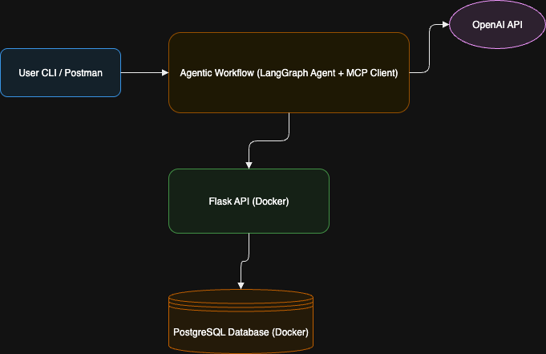

# project_tracker
AI-powered Project Tracker enabling agents to log tasks, fetch updates, and analyze progress via LLM queries. Includes a backend API for project data and an MCP tool connected to the LLM for status retrieval, filtering, and task management.

## Setup Instructions (Using Docker)

This project runs entirely with Docker. You only need **Docker Desktop** installed.

### Steps to Run
1. **Start containers** for the API and PostgreSQL:
   ```bash
   docker compose up --build
   ```

2. **Initialize the database** by calling the `/initdb` endpoint:
   ```bash
   curl http://localhost:5050/initdb
   ```

3. **(Optional) Add sample data** to the database:
   - Create a project:
     ```bash
     curl -X POST http://localhost:5050/projects \
       -H "Content-Type: application/json" \
       -d '{"name":"AI Tracker","description":"Demo","start_date":"2025-07-28","end_date":"2025-08-28","status":"active"}'
     ```
   - Add a task to the project:
     ```bash
     curl -X POST http://localhost:5050/tasks \
       -H "Content-Type: application/json" \
       -d '{"title":"Finish API","assigned_to":"Bob","status":"overdue","due_date":"2025-07-30","project_id":1}'
     ```

4. **Run the agent** interactively to ask questions:
   ```bash
   docker compose run agent python agent.py
   ```
   - The CLI will prompt:
     ```
     ask your questions here:
     ```
   - Enter your question, for example:
     ```
     how many tasks are overdue
     ```
   - Example CLI output:
     ```
     [+] Creating 2/0
      ✔ Container project_tracker_db   Running
      ✔ Container project_tracker_api  Running
     ask your questions here: how many tasks are overdue
     INFO:httpx:HTTP Request: POST https://api.openai.com/v1/chat/completions "HTTP/1.1 200 OK"
     INFO:root:[AGENT] Calling API with filters: {'status': 'overdue'}
     INFO:root:[MCP] Fetching tasks with filters: {'status': 'overdue'}
     INFO:root:[AGENT] API responded: {'filters': {'status': 'overdue'}, 'results': [{'id': 2, 'title': 'Finish API', 'assigned_to': 'Bob', 'status': 'overdue', 'due_date': '2025-07-30', 'project_id': 1}]}
     {'filters': {'status': 'overdue'}, 'results': [{'id': 2, 'title': 'Finish API', 'assigned_to': 'Bob', 'status': 'overdue', 'due_date': '2025-07-30', 'project_id': 1}]}
     ```

5.. **Architecture Diagram**
